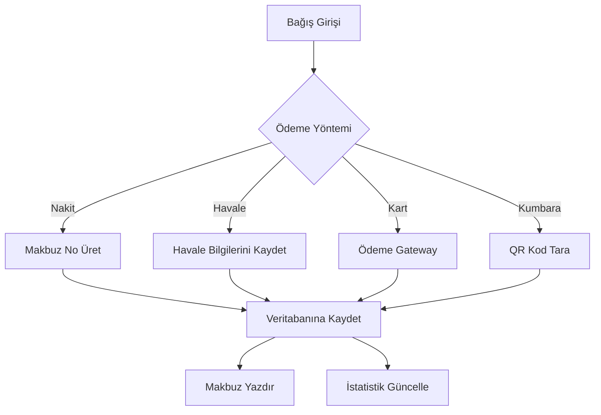
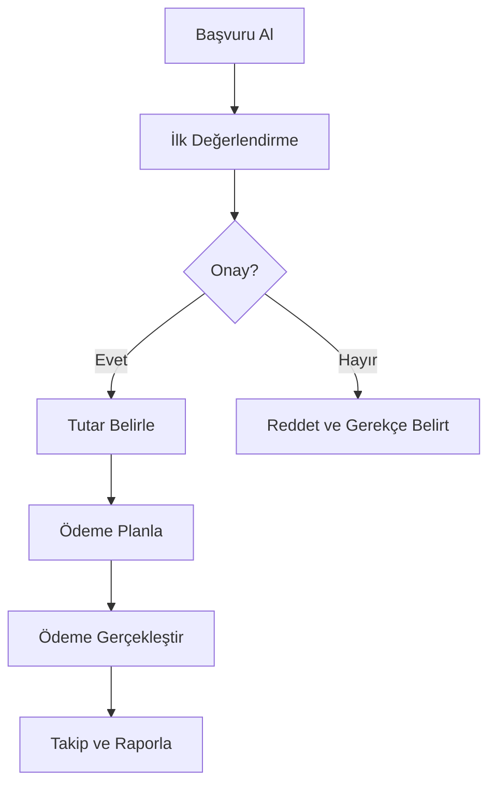

# KAFKASDER YÖNETİM PANELİ - ULTRA GENİŞ DOKÜMANTASYON

## 📋 PROJE GENEL BAKIŞ

**Kafkasder Yönetim Paneli**, Kafkas Göçmenleri Derneği'nin kapsamlı yönetim sistemi olup, bağış yönetimi, üye takibi, sosyal yardım işlemleri ve dernek operasyonlarını dijitalleştiren modern bir web uygulamasıdır.

### 🎯 Ana Özellikler
- **Bağış Yönetimi**: Nakit, havale, kredi kartı ve kumbara bağışları
- **Üye Takibi**: Dernek üyelerinin detaylı profili ve aidat yönetimi
- **Sosyal Yardım**: İhtiyaç sahibi ailelere kapsamlı yardım sistemi
- **Kumbara Sistemi**: QR kodlu akıllı kumbara yönetimi
- **Raporlama**: Detaylı istatistikler ve Excel export
- **Çoklu Kullanıcı**: Rol tabanlı yetkilendirme sistemi

---

## 🏗️ TEKNİK MİMARİ

### Teknoloji Stack
```json
{
  "Framework": "Next.js 16 (App Router)",
  "UI Library": "React 19",
  "Language": "TypeScript 5.9",
  "Styling": "Tailwind CSS 4.0",
  "Database": "Supabase (PostgreSQL)",
  "ORM": "Prisma",
  "State Management": "Zustand",
  "Data Fetching": "TanStack Query",
  "Forms": "React Hook Form + Zod",
  "Charts": "Recharts",
  "Icons": "Lucide React"
}
```

### Proje Yapısı
```
kafkasder-panel/
├── 📁 docs/                    # Dokümantasyon
├── 📁 prisma/                  # Veritabanı şeması
├── 📁 public/                  # Statik dosyalar
├── 📁 scripts/                 # Yardımcı scriptler
├── 📁 src/
│   ├── 📁 app/                 # Next.js App Router
│   │   ├── 📁 (auth)/          # Kimlik doğrulama sayfaları
│   │   ├── 📁 (dashboard)/     # Ana dashboard
│   │   └── 📁 globals.css      # Global stiller
│   ├── 📁 components/          # React bileşenleri
│   │   ├── 📁 features/        # Özellik bazlı bileşenler
│   │   ├── 📁 layout/          # Layout bileşenleri
│   │   ├── 📁 shared/          # Paylaşılan bileşenler
│   │   └── 📁 ui/              # UI temel bileşenleri
│   ├── 📁 hooks/               # Custom React hooks
│   ├── 📁 lib/                 # Yardımcı fonksiyonlar
│   │   ├── 📁 supabase/        # Supabase konfigürasyonu
│   │   └── 📁 validators.ts    # Form validasyonları
│   ├── 📁 providers/           # React providers
│   ├── 📁 stores/              # Zustand state stores
│   └── 📁 types/               # TypeScript tipleri
└── 📁 supabase/                # Supabase migrations
```

---

## 🔧 KURULUM VE YAPILANDIRMA

### Gereksinimler
- **Node.js**: 18.17+
- **npm/yarn/pnpm**: Paket yöneticisi
- **PostgreSQL**: Veritabanı (Supabase)
- **Git**: Versiyon kontrolü

### Kurulum Adımları
```bash
# 1. Projeyi klonla
git clone <repository-url>
cd kafkasder-panel

# 2. Bağımlılıkları yükle
npm install

# 3. Environment değişkenlerini ayarla
cp .env.example .env.local

# 4. Veritabanını hazırla
npm run db:generate
npm run db:push

# 5. Geliştirme sunucusunu başlat
npm run dev
```

### Environment Değişkenleri
```env
# Uygulama
NEXT_PUBLIC_APP_NAME="Kafkasder Yönetim Paneli"
NEXT_PUBLIC_APP_URL="http://localhost:3000"

# API Yapılandırması
NEXT_PUBLIC_API_URL="http://localhost:8000/api"
NEXT_PUBLIC_API_TIMEOUT="30000"
NEXT_PUBLIC_USE_MOCK_API="true"

# Supabase
NEXT_PUBLIC_SUPABASE_URL="your-supabase-url"
NEXT_PUBLIC_SUPABASE_ANON_KEY="your-anon-key"

# Kimlik Doğrulama
NEXT_PUBLIC_AUTH_COOKIE_NAME="auth-token"
NEXT_PUBLIC_AUTH_COOKIE_EXPIRES="86400"

# Özellik Bayrakları
NEXT_PUBLIC_ENABLE_QR_SCANNER="true"
NEXT_PUBLIC_ENABLE_EXCEL_EXPORT="true"
NEXT_PUBLIC_ENABLE_DEVTOOLS="true"
```

---

## 🎨 TASARIM SİSTEMİ

### Renk Paleti (OKLCH)
```css
:root {
  /* Ana Renkler */
  --primary: oklch(0.48 0.18 10);        /* #A91E3A - Bordo */
  --primary-foreground: oklch(0.99 0 0); /* #FFFFFF */

  /* Yüzeyler */
  --background: oklch(0.975 0.002 250);  /* #F5F7FA */
  --card: oklch(1 0 0);                  /* #FFFFFF */
  --muted: oklch(0.94 0.005 250);        /* Açık gri */

  /* Anlamsal Renkler */
  --success: oklch(0.60 0.16 155);       /* #16A34A */
  --warning: oklch(0.75 0.15 75);        /* #F59E0B */
  --destructive: oklch(0.55 0.20 25);    /* #DC2626 */

  /* Kenar Çubuğu */
  --sidebar: oklch(0.22 0.025 260);      /* #1E2330 */
  --sidebar-primary: oklch(0.65 0.16 10); /* Açık bordo */
}
```

### Tipografi
- **Font Family**: Geist Sans (UI), Geist Mono (kod)
- **Base Size**: 14px (0.875rem)
- **Line Height**: 1.5
- **Letter Spacing**: -0.02em (başlıklar için)

### Bileşen Tasarımı İlkeleri
1. **Tutarlı Spacing**: 4px grid sistemi
2. **Modern Border Radius**: 0.625rem (10px)
3. **Subtle Shadows**: Hover efektleri için
4. **High Contrast**: Erişilebilirlik için
5. **Responsive Design**: Mobile-first yaklaşım

---

## 📊 VERİ MODELLERİ

### Kullanıcı (User) Modeli
```typescript
interface User {
  id: string;
  name: string;
  email: string;
  phone?: string;
  role: UserRole;           // 'admin' | 'muhasebe' | 'gorevli' | 'uye'
  avatar?: string;
  isActive: boolean;
  lastLogin?: Date;
  permissions: Permission[];
  createdAt: Date;
  updatedAt: Date;
}
```

### Bağış (Donation) Modeli
```typescript
interface Bagis {
  id: string;
  bagisci: Bagisci;
  tutar: number;
  currency: Currency;       // 'TRY' | 'USD' | 'EUR'
  amac: DonationPurpose;    // 'genel' | 'egitim' | 'saglik' | ...
  odemeYontemi: PaymentMethod;
  durum: PaymentStatus;     // 'beklemede' | 'tamamlandi' | 'iptal'
  makbuzNo?: string;
  aciklama?: string;
  createdAt: Date;
  updatedAt: Date;
}
```

### İhtiyaç Sahibi (Beneficiary) Modeli
```typescript
interface IhtiyacSahibi {
  id: string;
  tur: IhtiyacSahibiTuru;
  kategori: IhtiyacSahibiKategori;
  ad: string;
  soyad: string;
  uyruk: string;
  tcKimlikNo?: string;
  yabanciKimlikNo?: string;
  dogumTarihi?: Date;
  cinsiyet?: Cinsiyet;

  // İletişim Bilgileri
  cepTelefonu?: string;
  email?: string;

  // Adres Bilgileri
  ulke: string;
  sehir: string;
  ilce?: string;
  mahalle?: string;
  adres?: string;

  // Detaylı Bilgiler
  kimlikBilgileri?: KimlikBilgileri;
  pasaportVizeBilgileri?: PasaportVizeBilgileri;
  saglikBilgileri?: SaglikBilgileri;
  ekonomikDurum?: EkonomikSosyalDurum;
  aileHaneBilgileri?: AileHaneBilgileri;

  // İstatistikler
  basvuruSayisi: number;
  yardimSayisi: number;
  toplamYardimTutari: number;
  sonYardimTarihi?: Date;

  // Sistem Alanları
  dosyaNo: string;
  durum: IhtiyacDurumu;
  rizaBeyaniDurumu: RizaBeyaniDurumu;
  kayitTarihi: Date;
  sonAtamaTarihi?: Date;

  createdAt: Date;
  updatedAt: Date;
}
```

---

## 🔐 KİMLİK DOĞRULAMA SİSTEMİ

### Rol Tabanlı Yetkilendirme
```typescript
type UserRole = 'admin' | 'muhasebe' | 'gorevli' | 'uye';

type Permission =
  | 'donations.view' | 'donations.create' | 'donations.edit' | 'donations.delete'
  | 'members.view' | 'members.create' | 'members.edit'
  | 'social-aid.view' | 'social-aid.approve'
  | 'reports.export'
  | 'settings.manage';
```

### Auth Store (Zustand)
```typescript
interface UserState {
  user: User | null;
  isAuthenticated: boolean;
  isLoading: boolean;
  login: (email: string, password: string) => Promise<boolean>;
  logout: () => void;
  updateUser: (updates: Partial<User>) => void;
}
```

### Middleware Koruması
```typescript
// src/middleware.ts
export function middleware(request: NextRequest) {
  const token = request.cookies.get('auth-token');

  if (!token && isProtectedRoute(request.nextUrl.pathname)) {
    return NextResponse.redirect(new URL('/giris', request.url));
  }

  return NextResponse.next();
}
```

---

## 🎯 ANA ÖZELLİKLER DETAYLI ANALİZİ

### 1. Bağış Yönetim Sistemi

#### Bağış Türleri
- **Nakit Bağış**: Direkt nakit ödemeler
- **Havale/EFT**: Banka transferleri
- **Kredi Kartı**: Online ödemeler
- **Kumbara**: QR kodlu akıllı kumbaralar

#### Bağış Akışı


#### Kumbara Sistemi
```typescript
interface Kumbara {
  id: string;
  kod: string;              // Benzersiz kumbara kodu
  ad: string;               // Kumbara adı
  konum: string;            // Yerleşim yeri
  koordinat?: GpsKoordinat; // GPS koordinatları
  qrKod?: KumbaraQR;        // QR kod bilgisi
  sorumlu: User;            // Sorumlu kişi
  durum: KumbaraStatus;     // aktif | pasif | bakim
  toplamTutar: number;      // Toplam toplanan miktar
  toplamaGecmisi: KumbaraToplama[];
}
```

### 2. Sosyal Yardım Modülü

#### İhtiyaç Sahibi Kategorileri
```typescript
type IhtiyacSahibiKategori =
  | 'yetim-ailesi'           // Yetim aileleri
  | 'multeci-aile'           // Mülteci aileleri
  | 'ihtiyac-sahibi-aile'    // Genel ihtiyaç sahibi
  | 'ogrenci-yabanci'        // Yabancı uyruklu öğrenci
  | 'ogrenci-tc'             // TC uyruklu öğrenci
  | 'vakif-dernek'           // Vakıf ve dernekler
  | 'devlet-okulu'           // Devlet okulları
  | 'kamu-kurumu'            // Kamu kurumları
  | 'ozel-egitim-kurumu';    // Özel eğitim kurumları
```

#### Yardım Başvuru Süreci


#### Yardım Türleri
- **Ayni Yardım**: Gıda, giyim, yakacak gibi maddi yardımlar
- **Nakdi Yardım**: Para yardımları
- **Eğitim Desteği**: Eğitim masrafları
- **Sağlık Desteği**: Tıbbi masraflar
- **Kira Yardımı**: Konut giderleri
- **Fatura Desteği**: Elektrik, su, doğalgaz

### 3. Üye Yönetim Sistemi

#### Üye Türleri
```typescript
type UyeTuru = 'aktif' | 'onursal' | 'genc' | 'destekci';

type AidatDurumu = 'guncel' | 'gecmis' | 'muaf';
```

#### Üye Bilgi Yapısı
```typescript
interface Uye {
  id: string;
  tcKimlikNo: string;
  ad: string;
  soyad: string;
  dogumTarihi: Date;
  cinsiyet: Cinsiyet;
  telefon: string;
  email?: string;
  adres: UyeAdres;
  uyeTuru: UyeTuru;
  uyeNo: string;
  kayitTarihi: Date;
  aidatDurumu: AidatDurumu;
  aidat: {
    tutar: number;
    sonOdemeTarihi?: Date;
  };
}
```

---

## 🔌 API VE VERİ YÖNETİMİ

### TanStack Query Entegrasyonu
```typescript
// Query Keys - Merkezi yönetim
export const queryKeys = {
  dashboard: {
    stats: ['dashboard-stats'] as const,
  },
  donations: {
    all: ['donations'] as const,
    list: (filters?: Record<string, unknown>) => ['donations', filters] as const,
  },
  // ... diğer query key'leri
} as const;

// Custom Hook Örneği
export function useDonations(params?: Parameters<typeof fetchDonations>[0]) {
  return useQuery({
    queryKey: queryKeys.donations.list(params),
    queryFn: () => fetchDonations(params || {}),
    staleTime: 5 * 60 * 1000, // 5 dakika
  });
}
```

### Supabase Servis Katmanı
```typescript
// Tip güvenli servis fonksiyonları
export async function fetchBeneficiaries(options?: {
  page?: number;
  pageSize?: number;
  search?: string;
  durum?: string;
}): Promise<PaginatedResponse<IhtiyacSahibi>> {
  const supabase = getSupabaseClient();

  let query = supabase
    .from('beneficiaries')
    .select('*', { count: 'exact' })
    .order('created_at', { ascending: false });

  if (options?.search) {
    query = query.or(`ad.ilike.%${options.search}%,soyad.ilike.%${options.search}%`);
  }

  const { data, error, count } = await query
    .range((options?.page || 1) - 1, (options?.page || 1) * (options?.pageSize || 10) - 1);

  if (error) throw error;

  return {
    data: (data || []).map(mapBeneficiary),
    total: count || 0,
    page: options?.page || 1,
    pageSize: options?.pageSize || 10,
    totalPages: Math.ceil((count || 0) / (options?.pageSize || 10))
  };
}
```

---

## 🎨 BİLEŞEN MİMARİSİ

### UI Bileşenleri (shadcn/ui)
```typescript
// Button Bileşeni - Özelleştirilmiş
interface ButtonProps extends React.ButtonHTMLAttributes<HTMLButtonElement> {
  variant?: 'default' | 'destructive' | 'outline' | 'secondary' | 'ghost' | 'link';
  size?: 'default' | 'sm' | 'lg' | 'icon';
  loading?: boolean;
  asChild?: boolean;
}

function Button({
  className,
  variant = 'default',
  size = 'default',
  loading = false,
  asChild = false,
  children,
  ...props
}: ButtonProps) {
  const Comp = asChild ? Slot : 'button';

  return (
    <Comp
      className={cn(buttonVariants({ variant, size }), className)}
      disabled={props.disabled || loading}
      {...props}
    >
      {loading && <Spinner className="size-4" />}
      {children}
    </Comp>
  );
}
```

### Veri Tablosu Bileşeni
```typescript
interface DataTableProps<TData, TValue> {
  columns: ColumnDef<TData, TValue>[];
  data: TData[];
  pageCount?: number;
  searchPlaceholder?: string;
  searchColumn?: string;
  isLoading?: boolean;
  filters?: FilterOption[];
  onRowClick?: (row: TData) => void;
  onExport?: (filteredData: TData[]) => void;
}

function DataTable<TData, TValue>({
  columns,
  data,
  isLoading,
  filters,
  onRowClick,
  onExport
}: DataTableProps<TData, TValue>) {
  // TanStack Table entegrasyonu
  const table = useReactTable({
    data,
    columns,
    getCoreRowModel: getCoreRowModel(),
    getPaginationRowModel: getPaginationRowModel(),
    getSortedRowModel: getSortedRowModel(),
    getFilteredRowModel: getFilteredRowModel(),
  });

  return (
    <div className="space-y-4">
      <DataTableToolbar table={table} filters={filters} onExport={onExport} />
      <div className="rounded-md border">
        <Table>
          <TableHeader>
            {table.getHeaderGroups().map(headerGroup => (
              <TableRow key={headerGroup.id}>
                {headerGroup.headers.map(header => (
                  <TableHead key={header.id}>
                    {flexRender(header.column.columnDef.header, header.getContext())}
                  </TableHead>
                ))}
              </TableRow>
            ))}
          </TableHeader>
          <TableBody>
            {isLoading ? (
              <LoadingRows />
            ) : table.getRowModel().rows?.length ? (
              table.getRowModel().rows.map(row => (
                <TableRow
                  key={row.id}
                  onClick={() => onRowClick?.(row.original)}
                  className={onRowClick ? 'cursor-pointer' : undefined}
                >
                  {row.getVisibleCells().map(cell => (
                    <TableCell key={cell.id}>
                      {flexRender(cell.column.columnDef.cell, cell.getContext())}
                    </TableCell>
                  ))}
                </TableRow>
              ))
            ) : (
              <EmptyState />
            )}
          </TableBody>
        </Table>
      </div>
      <DataTablePagination table={table} />
    </div>
  );
}
```

---

## 📱 RESPONSIVE TASARIM

### Breakpoint Sistemi
```typescript
const breakpoints = {
  sm: 640,   // Small tablets
  md: 768,   // Tablets
  lg: 1024,  // Small laptops
  xl: 1280,  // Laptops
  '2xl': 1536 // Large screens
};

type Breakpoint = keyof typeof breakpoints;

// Custom Hook
export function useBreakpoint(breakpoint: Breakpoint): boolean {
  return useMediaQuery(`(min-width: ${breakpoints[breakpoint]}px)`);
}

export function useIsMobile(): boolean {
  return useMediaQuery(`(max-width: ${breakpoints.md - 1}px)`);
}
```

### Layout Adaptasyonu
```typescript
// Sidebar - Responsive davranış
function Sidebar() {
  const isMobile = useIsMobile();
  const { isOpen, setOpen } = useSidebarStore();

  return (
    <>
      {/* Desktop Sidebar */}
      <DesktopSidebar />

      {/* Mobile Sidebar (Sheet) */}
      {isMobile && (
        <Sheet open={isOpen} onOpenChange={setOpen}>
          <SheetContent side="left" className="w-72 p-0">
            <MobileSidebarContent />
          </SheetContent>
        </Sheet>
      )}
    </>
  );
}
```

---

## 🔍 PERFORMANS OPTİMİZASYONLARI

### Bundle Analizi
```javascript
// next.config.ts
const nextConfig = {
  experimental: {
    optimizePackageImports: [
      'lucide-react',
      '@radix-ui/react-icons',
      'recharts',
      'date-fns',
      '@tanstack/react-table',
      '@tanstack/react-query',
      '@radix-ui/react-dialog',
      '@radix-ui/react-dropdown-menu',
      '@radix-ui/react-select',
      '@radix-ui/react-tabs',
      '@radix-ui/react-tooltip',
      'react-hook-form',
      'zod',
    ],
  },

  images: {
    formats: ['image/avif', 'image/webp'],
    deviceSizes: [640, 750, 828, 1080, 1200, 1920],
    imageSizes: [16, 32, 48, 64, 96, 128, 256],
  },

  compiler: {
    removeConsole: process.env.NODE_ENV === 'production',
  },
};
```

### Lazy Loading ve Code Splitting
```typescript
// Lazy load ağır bileşenler
const CommandPalette = lazy(() =>
  import('@/components/shared/command-palette')
    .then(mod => ({ default: mod.CommandPalette }))
);

const LazyChart = lazy(() =>
  import('@/components/shared/lazy-chart')
    .then(mod => ({ default: mod.LazyChart }))
);

// Progress bar lazy load
const ProgressBar = dynamic(
  () => import('@/components/layout/progress-bar')
    .then(mod => ({ default: mod.ProgressBar })),
  { ssr: false }
);
```

### Query Optimizasyonu
```typescript
// TanStack Query konfigürasyonu
const queryClient = new QueryClient({
  defaultOptions: {
    queries: {
      staleTime: 5 * 60 * 1000, // 5 dakika
      gcTime: 10 * 60 * 1000,   // 10 dakika
      refetchOnWindowFocus: false,
      refetchOnMount: false,
      refetchOnReconnect: true,
      retry: 1,
      retryDelay: (attemptIndex) => Math.min(1000 * 2 ** attemptIndex, 30000),
    },
    mutations: {
      retry: 1,
      retryDelay: 1000,
    },
  },
});
```

---

## 🧪 TEST VE KALİTE GÜVENCE

### Test Yapılandırması
```javascript
// jest.config.js
module.exports = {
  testEnvironment: 'jsdom',
  setupFilesAfterEnv: ['<rootDir>/jest.setup.js'],
  moduleNameMapping: {
    '^@/(.*)$': '<rootDir>/src/$1',
  },
  collectCoverageFrom: [
    'src/**/*.{ts,tsx}',
    '!src/**/*.d.ts',
  ],
  coverageThreshold: {
    global: {
      branches: 70,
      functions: 70,
      lines: 70,
      statements: 70,
    },
  },
};
```

### E2E Test (Playwright)
```typescript
// playwright.config.ts
import { defineConfig } from '@playwright/test';

export default defineConfig({
  testDir: './tests/e2e',
  use: {
    baseURL: 'http://localhost:3000',
    screenshot: 'only-on-failure',
    video: 'retain-on-failure',
  },
  projects: [
    {
      name: 'chromium',
      use: { browserName: 'chromium' },
    },
  ],
});
```

### ESLint ve Prettier Yapılandırması
```javascript
// eslint.config.mjs
import { dirname } from 'path';
import { fileURLToPath } from 'url';
import { FlatCompat } from '@eslint/eslintrc';

const __filename = fileURLToPath(import.meta.url);
const __dirname = dirname(__filename);

const compat = new FlatCompat({
  baseDirectory: __dirname,
});

const eslintConfig = [
  ...compat.extends('next/core-web-vitals', 'next/typescript'),
  {
    rules: {
      '@typescript-eslint/no-unused-vars': ['error', { argsIgnorePattern: '^_' }],
      '@typescript-eslint/no-explicit-any': 'warn',
      'react-hooks/exhaustive-deps': 'warn',
    },
  },
];

export default eslintConfig;
```

---

## 🚀 DAĞITIM VE DEVOPS

### Build Optimizasyonu
```bash
# Build komutları
npm run build              # Production build
npm run build:analyze      # Bundle analyzer ile build
npm run start              # Production server

# Development
npm run dev                # Development server
npm run type-check         # TypeScript kontrolü
npm run lint               # ESLint kontrolü
npm run format             # Prettier format
```

### Environment Yapılandırması
```bash
# Production environment
NODE_ENV=production
NEXT_PUBLIC_APP_URL=https://kafkasder-panel.vercel.app
NEXT_PUBLIC_SUPABASE_URL=your-production-supabase-url
NEXT_PUBLIC_SUPABASE_ANON_KEY=your-production-anon-key
NEXT_PUBLIC_USE_MOCK_API=false
```

### CI/CD Pipeline
```yaml
# .github/workflows/deploy.yml
name: Deploy to Production

on:
  push:
    branches: [main]

jobs:
  deploy:
    runs-on: ubuntu-latest
    steps:
      - uses: actions/checkout@v3
      - uses: actions/setup-node@v3
        with:
          node-version: '18'
          cache: 'npm'

      - run: npm ci
      - run: npm run type-check
      - run: npm run lint
      - run: npm run build

      - uses: vercel/action-deploy@v1
        with:
          vercel-token: ${{ secrets.VERCEL_TOKEN }}
          vercel-org-id: ${{ secrets.VERCEL_ORG_ID }}
          vercel-project-id: ${{ secrets.VERCEL_PROJECT_ID }}
```

---

## 📈 İZLEME VE ANALİTİK

### Performans İzleme
```typescript
// Web Vitals izleme
// src/app/web-vitals.tsx
'use client';

import { useEffect } from 'react';
import { usePathname } from 'next/navigation';
import { getCLS, getFID, getFCP, getLCP, getTTFB } from 'web-vitals';

export function WebVitals() {
  const pathname = usePathname();

  useEffect(() => {
    getCLS(console.log);
    getFID(console.log);
    getFCP(console.log);
    getLCP(console.log);
    getTTFB(console.log);
  }, [pathname]);

  return null;
}
```

### Error Boundary
```typescript
// src/components/shared/error-boundary.tsx
'use client';

import React from 'react';
import { AlertTriangle } from 'lucide-react';
import { Button } from '@/components/ui/button';

interface ErrorBoundaryState {
  hasError: boolean;
  error?: Error;
}

export class ErrorBoundary extends React.Component<
  { children: React.ReactNode; fallback?: React.ComponentType<{ error: Error; reset: () => void }> },
  ErrorBoundaryState
> {
  constructor(props: { children: React.ReactNode }) {
    super(props);
    this.state = { hasError: false };
  }

  static getDerivedStateFromError(error: Error): ErrorBoundaryState {
    return { hasError: true, error };
  }

  componentDidCatch(error: Error, errorInfo: React.ErrorInfo) {
    console.error('Error caught by boundary:', error, errorInfo);
    // Log to error reporting service
  }

  render() {
    if (this.state.hasError) {
      if (this.props.fallback) {
        const FallbackComponent = this.props.fallback;
        return (
          <FallbackComponent
            error={this.state.error!}
            reset={() => this.setState({ hasError: false, error: undefined })}
          />
        );
      }

      return (
        <div className="flex flex-col items-center justify-center min-h-[400px] p-8">
          <AlertTriangle className="h-12 w-12 text-destructive mb-4" />
          <h2 className="text-xl font-semibold mb-2">Bir Hata Oluştu</h2>
          <p className="text-muted-foreground mb-4 text-center">
            Üzgünüz, beklenmedik bir hata oluştu.
          </p>
          <Button onClick={() => this.setState({ hasError: false, error: undefined })}>
            Tekrar Dene
          </Button>
        </div>
      );
    }

    return this.props.children;
  }
}
```

---

## 📚 KULLANIM KILAVUZU

### İlk Giriş
1. **Giriş Yapın**: `/giris` sayfasından email ve şifre ile giriş yapın
2. **Demo Hesap**: Herhangi bir email ve 6+ karakter şifre kullanabilirsiniz
3. **Dashboard**: Ana sayfa istatistikleri gösterir

### Bağış Kaydı
1. **Bağışlar** menüsünden **Yeni Bağış** butonuna tıklayın
2. Bağışçı bilgilerini girin
3. Tutar ve ödeme yöntemini seçin
4. Makbuz numarası otomatik oluşturulur

### İhtiyaç Sahibi Kaydı
1. **Sosyal Yardım** > **İhtiyaç Sahipleri**'ne gidin
2. **Ekle** butonuna tıklayın
3. Detaylı bilgileri girin (kimlik, adres, ekonomik durum vb.)
4. Kategori ve durumu belirleyin

### Raporlama
1. **Raporlar** bölümünden istediğiniz raporu seçin
2. Filtreleri uygulayın
3. Excel olarak indirin veya görüntüleyin

---

## 🔧 GELİŞTİRME KILAVUZU

### Yeni Özellik Ekleme
1. **Planlama**: Özelliği tasarla ve gereksinimleri belirle
2. **API**: Gerekli endpoint'leri ekle (mock + gerçek)
3. **Types**: TypeScript tiplerini tanımla
4. **Component**: UI bileşenlerini oluştur
5. **Integration**: Hook'ları ve servisleri bağla
6. **Test**: Birim ve entegrasyon testleri yaz
7. **Documentation**: Dokümantasyonu güncelle

### Kod Standartları
```typescript
// Dosya yapısı
components/
  features/        # Özellik bazlı bileşenler
    FeatureName/
      index.tsx    # Ana bileşen
      form.tsx     # Form bileşeni
      columns.tsx  # Tablo kolonları
      types.ts     # Özellik tipleri

// Naming conventions
- PascalCase: Component isimleri
- camelCase: Değişken ve fonksiyon isimleri
- kebab-case: Dosya isimleri
- UPPER_CASE: Sabitler

// Import sıralaması
1. React imports
2. Third-party libraries
3. Internal modules (hooks, lib, components)
4. Types
5. Utils
```

---

## 🎯 SONUÇ VE DEĞERLENDİRME

**Kafkasder Yönetim Paneli**, modern web teknolojileri kullanarak dernek yönetimini dijitalleştiren kapsamlı bir çözümdür. Aşağıdaki temel değerleri sağlar:

### ✅ Başarı Metrikleri
- **Performans**: Hızlı yükleme ve akıcı kullanıcı deneyimi
- **Güvenilirlik**: TypeScript ile tip güvenliği
- **Ölçeklenebilirlik**: Modüler mimari
- **Erişilebilirlik**: Responsive tasarım ve ARIA desteği
- **Bakım Kolaylığı**: Temiz kod ve kapsamlı dokümantasyon

### 🚀 Gelecek Geliştirmeler
- **Mobil Uygulama**: React Native ile native app
- **Çoklu Dil Desteği**: i18n entegrasyonu
- **Gelişmiş Analitik**: AI destekli raporlama
- **Blockchain**: Bağış şeffaflığı için
- **IoT Entegrasyonu**: Akıllı kumbara donanım entegrasyonu

### 📞 Destek ve İletişim
- **Dokümantasyon**: Bu dosya ve `/docs` klasörü
- **Issue Tracker**: GitHub Issues
- **Discussions**: GitHub Discussions
- **Email**: destek@kafkasder.org

---

*Bu dokümantasyon Kafkasder Yönetim Paneli'nin kapsamlı teknik kılavuzudur. Projeyi geliştirmek veya sorun gidermek için bu dokümantasyonu referans alın.*